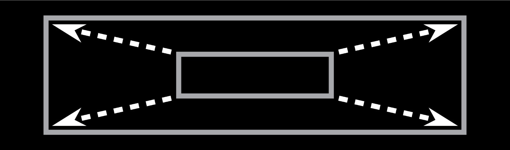

# p5.scaler

Auto scales sketches in order to fit the browser's inner dimensions.

## Getting started :beginner:

- [Download](https://raw.githubusercontent.com/Morfologia-digital/p5.scaler/main/p5.scaler.js) the p5.scaler.js file to your existing p5.js project
- Link the file in your index.html. It should look something like this:

```
    <script src="p5.min.js"></script>
    <script src="p5.scaler.js"></script>
    <script src="sketch.js"></script>
```

- On your sketch code, instead of calling the `createCanvas()`, use `createAdaptiveCanvas()`. This function has three arguments:
  - _width_ - the original width of your canvas, in pixels
  - _height_ - the original height of your canvas, in pixels
  - _fitScreen_ - whether or not the canvas should auto scale to fit the screen. Default value is _true_. You may want to set it to _false_ during development
- From now on, if you need to retrieve the width/height of your canvas (originally done through the `width` & `height` global properties), you should use `scaler.width()` and `scaler.height()`
- From now on, if you need to retrieve mouseX,mouseY (originally done through the `mouseX` & `mouseY` global properties), you should use `scaler.mouseX()` and `scaler.mouseY()`
- From now on, if you need to retrieve pmouseX,pmouseY (originally done through the `pmouseX` & `pmouseY` global properties), you should use `scaler.pmouseX()` and `scaler.pmouseY()`

Here is a simple example:

```
function setup() {
  createAdaptiveCanvas(500, 500);
  noStroke();
}

function draw() {
  background(200);

  fill(0,0,255);
  ellipse(scaler.width() / 2, scaler.height() / 2, 100, 100);

  fill(255,0,0);
  ellipse(scaler.mouseX(),scaler.mouseY(),50,50);
}
```

## Factor scaling :art:

You may want to scale your canvas to a factor. This may be particularly useful if you want to generate files for printing. In order to do that, you just need to follow these two steps:

- disable auto-scaling, by making sure your `createAdaptiveCanvas()` call has _false_ to the _fitScreen_ argument;
- in the last line of your `setup()` function add the following line:

```
// scaleFactor is a float-pointing number
scaler.scaleCanvasTo(scaleFactor);
```

- Right click on the rendered canvas and select "Save image as..." and select the folder location to save the scaled PNG file.

## Scaling p5.Renderer objects :tv:

If your sketch has _p5.Renderer_ objects (they are VERY useful as buffers), you will need to tell _p5.scaler_ about them. Just complete the following steps:

- instead of calling the `createGraphics()` function, use `createAdaptiveGraphics()`. This function has three arguments:
  - _width_ - the original width of your _p5.Renderer_, in pixels
  - _height_ - the original height of your _p5.Renderer_, in pixels
  - _bufferRenderer_ - a function that receives a regular _p5.Renderer_ as a parameter and is responsible for the actual drawing of that buffer (_refreshing the buffer_ might be the accurate idea here). So, everytime the canvas is resized, this function is called to re-draw your _p5.Renderer_
- make sure you have a rendering function to your _p5.Renderer_, to pass as the last argument of the `createAdaptiveGraphics()` function. Here is a simple example:

```
  // declares the buffer variable
  let pg;

  function setup() {
    // instantiates the buffer
    pg = createAdaptiveGraphics(
      scaler.width() / 2,
      scaler.height() / 2,
      renderBuffer
    );
    pg.reRender();
  }

  // specification of the function that will render the buffer
  function renderBuffer(b) {
    b.background(0);
    b.ellipse(b.width/2, b.height/2, 100, 100);
  }

  function draw() {
    translate(scaler.width() / 2, scaler.height() / 2);
    // renders the buffer right on the center of the main canvas
    image(pg.graphics(), -pg.graphics().width / 2, -pg.graphics().height / 2);
  }

```

- make sure you call `pg.reRender()` once just after instantiating the buffer with `createAdapativeGraphics()`
- to print the buffer content, please use the `pg.graphics()` method
- alternatively, you can use `addAdaptiveGraphics()` to register a previously created `p5.Renderer` object.

## Methods

### createAdaptiveCanvas(width, height, fitScreen)

Creates and returns an adapative canvas for the sketch.

| Parameter | Type    | Required | Description                                                                                                      |
| --------- | ------- | -------- | ---------------------------------------------------------------------------------------------------------------- |
| width     | Number  | Yes      | original width of the canvas in pixels                                                                           |
| height    | Number  | Yes      | original height of the canvas in pixels                                                                          |
| fitScreen | Boolean | No       | if the canvas should fit the browser size or no (hence, acting as regular p5.js canvas). Default value is _true_ |

### addAdaptiveGraphics()(width, height, bufferRenderer)

Creates and returns a p5.Renderer object, that will follow the scaling of the main canvas.

| Parameter      | Type     | Required | Description                                                                                                                                                                                         |
| -------------- | -------- | -------- | --------------------------------------------------------------------------------------------------------------------------------------------------------------------------------------------------- |
| width          | Number   | Yes      | original width of the canvas in pixels                                                                                                                                                              |
| height         | Number   | Yes      | original height of the canvas in pixels                                                                                                                                                             |
| bufferRenderer | function | Yes      | this parameter must be a function that will specify how the p5.Renderer object will be drawn. When specifying that function, expect a `b` parameter, representing a conventional p5.Renderer object |

### addAdaptiveGraphics(graphics, bufferRenderer)

Registers an existing p5.Renderer object to the list of buffers that will follow the scaling of the main canvas.

| Parameter      | Type        | Required | Description                                                                                                                                                                                         |
| -------------- | ----------- | -------- | --------------------------------------------------------------------------------------------------------------------------------------------------------------------------------------------------- |
| graphics       | p5.Renderer | Yes      | the existing p5.Renderer object                                                                                                                                                                     |
| bufferRenderer | function    | Yes      | this parameter must be a function that will specify how the p5.Renderer object will be drawn. When specifying that function, expect a `b` parameter, representing a conventional p5.Renderer object |

### The `scaler` object methods

| Method           | Description                                                 |
| ---------------- | ----------------------------------------------------------- |
| width()          | current width of the canvas                                 |
| height()         | current height of the canvas                                |
| mouseX()         | current X coordinate for the mouse pointer position         |
| mouseY()         | current X coordinate for the mouse pointer position         |
| pmouseX()        | previous X coordinate for the mouse pointer position        |
| pmouseY()        | previous X coordinate for the mouse pointer position        |
| scaleCanvasTo(s) | forces the scaling of the canvas to a `s` multiplier factor |

## Examples

The `/examples` folder in this repository contains the following examples:

| Example    | Description                                              |
| ---------- | -------------------------------------------------------- |
| Example 01 | p5.scaler.js most basic usage                            |
| Example 02 | shows how to force the scaling of the canvas to a factor |
| Example 03 | shows how to use p5.Renderer object as adaptive buffers  |
| Example 04 | show the usage of mouseX and mouseY properties           |

## Task list :seedling:

- [ ] **We strongly believe the features added by p5.scaler.js could fit as standard code for the p5.js library. Maybe you can help us by suggesting that to the authors [here](https://github.com/processing/p5.js)**;
- [ ] Add compability with the p5 WEBGL renderer;
- [ ] Add the option to unlock the original ratio, making the canvas fit the entire space in both width and height;
- [ ] Make the adaptive canvas use as reference its container, and not the browser window width/height (i.e., a div that contains the canvas);
- [ ] Add log messages to the console when something is wrong, to help programmers;
- [x] Add support to mouseX and mouseY properties.They should be used as `scaler.mouseX()` and `scaler.mouseY()`;
